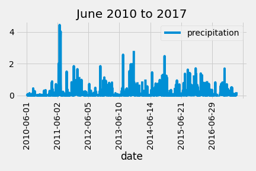
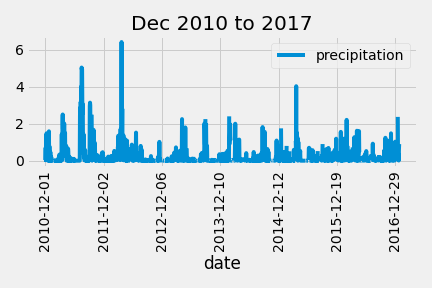

# surfs up

## Background

SQLite database: W. Avy has stored the weather data in a SQLite database. All SQLite databases are flat files, which means that they don't have relationships that connect the data to anything else. As a result, flat files can be stored locally, which will help us move more quickly through the analysis.

W. Avy is concerned about the amount of precipitation on Oahu. There needs to be enough rain to keep everything green, but not so much that we lose out on that ideal surfing and ice cream weather.

I know that I can set W. Avy's mind at ease by analyzing precipitation levels and showing him the cold, hard, data that backs up Oahu as the perfect place to surf. I have the last 12 months of precipitation data already loaded into my SQLite database.

W. Avy supplied me with the data he wants me to use and has asked me to look at a full year of data. When deciding how to parse the data, I remember that his favorite day is August 23, 2017 because it's the anniversary of the first time he ever went surfing and had ice cream on the same day. So, I decide to start the analysis there.

## Overview of Project
### Purpose

W. Avy likes my analysis, but he wants more information about temperature trends before opening the surf shop. Specifically, he wants temperature data for the months of June and December in Oahu, in order to determine if the surf and ice cream shop business is sustainable year-round.

## Analysis And Challenges

## Methodology: Analytics Paradigm

#### 1. Decomposing the Ask
1. Query the database only for June and December for:
* temperature
* precipitation

#### 2. Identify the Datasource
* SQLite database: hawaii.sqlite

#### 3. Define Strategy & Metrics
**Resource:** Python 3, Flask, Pandas, Jupyter Notebook, sqlLite, sqlalchemy

#### 4. Data Retrieval Plan
Using Python SQL toolkit and Object Relational Mapper, sqlAchemy to query and retrieve the data for June & December.

#### 5. Assemble & Clean the Data
While some June & December data has NaN values, there is no difference in the final data analysis if we dropna() or not as the charts will show the same results regardless.

#### 6. Analyse for Trends

Understanding precipitation:

* Light rain — when the precipitation rate is < 2.5 mm (0.098 in) per hour.
* Moderate rain — when the precipitation rate is between 2.5 mm (0.098 in) – 7.6 mm (0.30 in) or 10 mm (0.39 in) per hour.
* Heavy rain — when the precipitation rate is > 7.6 mm (0.30 in) per hour or between 10 mm (0.39 in) and 50 mm (2.0 in) per hour

#### 7. Acknowledging Limitations
As we are only using weather data, it does not necessarily indicates that our business will be successful as Oahu, Hawaii still depends largely on tourists as customers and currently with Covid restriction, the lack of tourist customers will still impact business even if the weather is amazing.  

#### 8. Making the Call:
The "Proper" Conclusion is indicated below on [Summary](#summary)

## Analysis

>June Temperature Aggregates

>June Temperature

As seen above for June between 2010 to 2017, the temperature has a _**average of 74.9 Fahrenheit**_ with  min of 64 Fahrenheit and max of 85 Fahrenheit. From the histogram, the temperature is frequently between 72 to 79 Fahrenheit.

>June Precipitation Aggregates

>June Precipitation

As seen above for June between 2010 to 2017, the precipitation has a _**average of 0.13 mm**_ with  min of 0 mm and max of 4.43 mm. From the histogram, the rain precipitation rarely goes above 2 mm.

>December Temperature Aggregates

>December Temperature

As seen above for December between 2010 to 2017, the temperature has a _**average of 71.04 Fahrenheit**_ with  min of 56 Fahrenheit and max of 83 Fahrenheit. From the histogram, the temperature is frequently between 66 to 75 Fahrenheit.

>December Precipitation Aggregates

>December Precipitation

As seen above for December between 2010 to 2017, the precipitation has a _**average of 0.21 mm**_ with  min of 0 mm and max of 6.42 mm. From the histogram, the rain precipitation rarely goes above 2.5 mm.

### Key Differences between June and December
1. The temperature in June with _**average of 74.9 Fahrenheit**_ of is slightly higher than December with _**average of 71.04 Fahrenheit**_.
2. The temperature in June is more warm and does not fluctuate with _**min of 64 Fahrenheit and max of 85 Fahrenheit**_ than December which fluctuates between _**min of 56 Fahrenheit and max of 83 Fahrenheit**_. December could be colder than June at the lower temperatures due to the higher precipitation compared to June.
3. June has an average precipitation at _**0.13 mm**_ and a maximum precipitation at _**4.43 mm**_ while December has an average precipitation at _**0.21 mm**_ and a maximum precipitation at _**6.42 mm**_. So on average December has _**0.08 mm**_ more precipitation than June.

## Summary

### June 2010 to 2017
The temperature quite often between 72 to 79 Fahrenheit.
From precipitation chart [6 Analyse For Trends](#6-analyse-for-trends), June only has light rain that rarely goes on for more than 1 hour.
This is a comfortably warm weather with low to slight rain.

### December 2010 to 2017
The temperature quite often between 66 to 75 Fahrenheit.
From precipitation chart [6 Analyse For Trends](#6-analyse-for-trends), December has slightly more rain than June at an average of 2.5mm  but it is still within light rain that rarely goes on for more than 1 hour and rarely goes towards moderate rain.
This is a comfortably warm weather with slight rain.

From the analysis of temperature and precipitation in Oahu for June and December 2010 to 2017, the unusual high rain that W. Avy experienced previously is unlikely to happen again and the weather is suitable for a surf and ice cream shop business.

## Appendix
